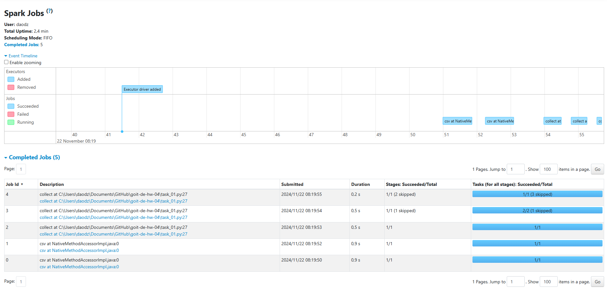
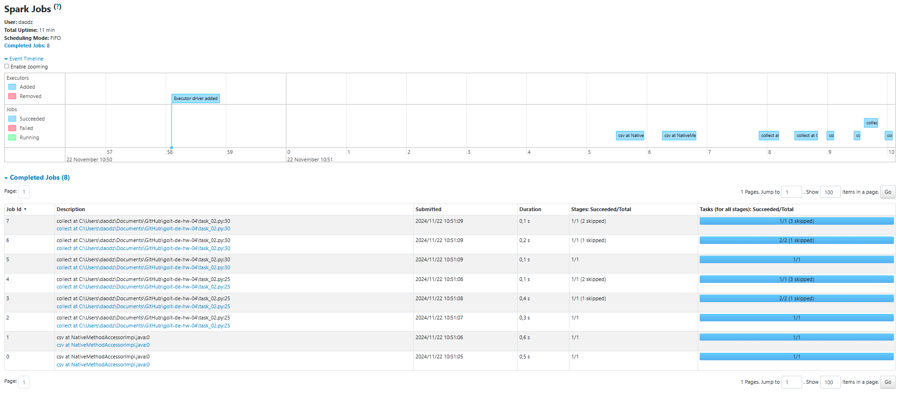

# Homework: Topic “Apache Spark. Optimization and SparkUI”

Hello! 😉

In this homework, the code is already written for you! However, that might make the assignment even trickier. Your task involves running multiple versions of similar code and analyzing the SparkUI interface.

Here's what you need to do:

1. Run three different programs.
2. Take screenshots of the three sets of Jobs.
3. Analyze and justify the number of Jobs in each set.
4. Understand what the cache function does and why it’s used.

### Step-by-Step Instructions

**Part 1**
We’ll use the familiar code as a base and add an intermediate operation:

Result of code in task_01.py:


### Part 2
We’ll add an intermediate action, collect:

Result of code in task_02.py:


> 🧠 Think: Why does adding just one intermediate action result in 3 more Jobs?

### Part 3
We’ll introduce a new function: `cache`.

> ☝🏻 The cache() function in PySpark is used to store (or “cache”) data from an RDD (Resilient Distributed Dataset) or DataFrame in memory. This helps speed up subsequent actions or transformations applied to the same data. Caching is especially useful when multiple operations are performed on the same RDD or DataFrame because PySpark won’t need to recompute the data each time.

**How cache() works:**

1. **Memory caching**: When you call cache() on an RDD or DataFrame, the data is stored in memory (RAM) in a distributed format across all cluster nodes. This improves the performance of future calculations by avoiding repeated data loading or computation.
2. **Lazy execution**: Calling cache() doesn’t trigger immediate computation. Only when an action (like count(), collect(), or show()) is executed will the data be computed and cached.
3. **Storage mechanism**: By default, cache() uses memory (MEMORY_ONLY). If the data doesn’t fit in memory, Spark writes it to disk.
4. **Cache control**: By default, cached data is stored with the MEMORY_ONLY storage level. To use other storage levels like MEMORY_AND_DISK, you can use the persist() method instead.

> ☝🏻 No need to dive deep into these technicalities during this practical assignment. The key takeaway is that data can be stored either in memory or on disk, with memory being the far more common option, while disk storage is rare and exotic 😉.

```python
from pyspark.sql import SparkSession

# Створюємо сесію Spark
spark = SparkSession.builder \
    .master("local[*]") \
    .config("spark.sql.shuffle.partitions", "2") \
    .appName("MyGoitSparkSandbox") \
    .getOrCreate()

# Завантажуємо датасет
nuek_df = spark.read \
    .option("header", "true") \
    .option("inferSchema", "true") \
    .csv('./nuek-vuh3.csv')

nuek_repart = nuek_df.repartition(2)

nuek_processed_cached = nuek_repart \
    .where("final_priority < 3") \
    .select("unit_id", "final_priority") \
    .groupBy("unit_id") \
    .count() \
    .cache()  # Додано функцію cache

# Проміжний action: collect
nuek_processed_cached.collect()

# Ось ТУТ додано рядок
nuek_processed = nuek_processed_cached.where("count>2")

nuek_processed.collect()

input("Press Enter to continue...5")

# Звільняємо пям'ять від Dataframe
nuek_processed_cached.unpersist()

# Закриваємо сесію Spark
spark.stop()

```

1. Run the code using cache() on an intermediate result.
2. Take a screenshot of all Jobs (there should be 7).

> 🧠 Think: Why does using `cache()` reduce the number of Jobs?
